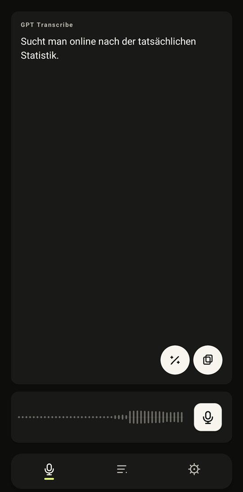
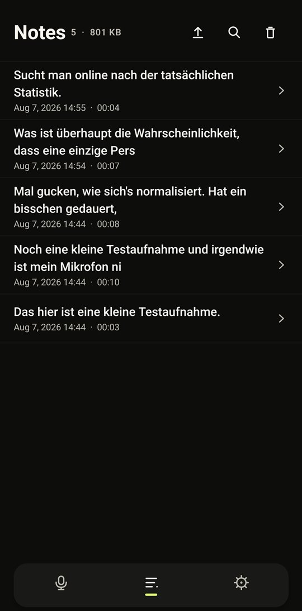
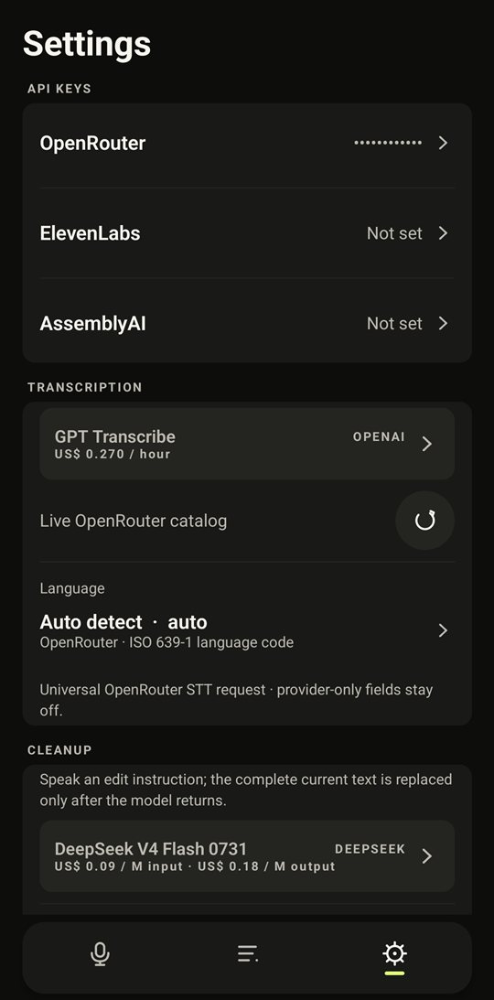
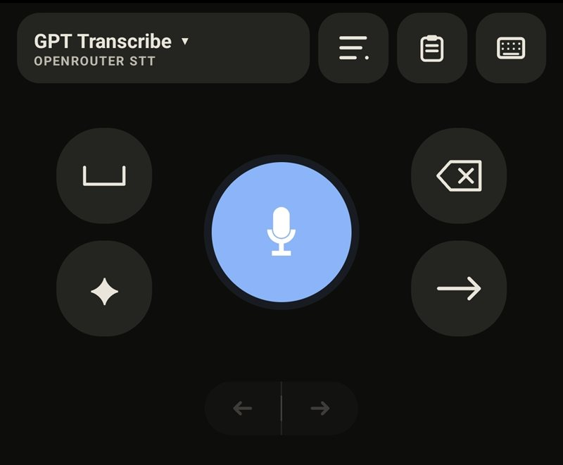
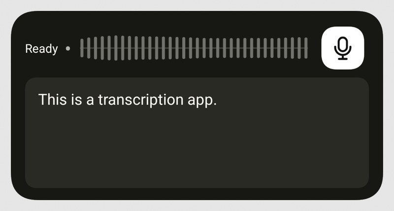

# Transcription for Android

A voice-note transcription app and a system-wide voice keyboard, built around
API keys you bring yourself. Tap record, talk, tap done — the audio goes to a
speech-to-text provider of your choice (OpenRouter, ElevenLabs, or AssemblyAI),
an LLM cleans the raw transcript up, and the result lands in the text field
you were in, on your clipboard, and in a local history with the original audio
attached.

There is no account, no server of mine, and no subscription. The app talks
directly to the provider APIs. Your keys are stored encrypted on the device
with the Android Keystore and are sent only to the provider they belong to,
for authentication — never to any server operated by this project. What a
transcription costs is
whatever the provider bills you — usually somewhere between a few cents and
about a dollar per hour of audio, and the model picker shows the normalized
per-hour price of every model before you pick it.

<p align="center">
  
  
  
</p>
<p align="center">
  
  
</p>

## What it does

**Recording.** Foreground recording with live waveform, pause/resume, and
discard — from the app, a home-screen widget, or a persistent quick-record
notification. Recordings are archived locally as M4A and stay playable in the
app.

**Transcription.** One shared pipeline for OpenRouter speech-to-text models,
OpenRouter multimodal audio models, ElevenLabs Scribe, and AssemblyAI. The
OpenRouter model catalog is fetched live, prices are normalized to one hour of
audio, and a configurable fallback model retries every failed request once.
Optional silence trimming cuts pauses out of the upload — providers bill
wall-clock audio, so this directly saves money.

**Cleanup.** Every finished transcript can be run through an OpenRouter text
model before it's inserted. The modes range from *Clean* (strip the "ums",
false starts, and self-corrections; execute spoken commands like "new
paragraph" or "scratch that" instead of typing them out) through *Polish*,
*Concise*, *Formal*, *Casual*, and *Notes* up to *Prompt*, which reshapes a
dictated request into a clear instruction for an AI. Each mode has an editable
system prompt. If the cleanup model fails, you get the raw transcript instead
of losing the recording.

**The voice keyboard.** A minimal IME that replaces typing with dictation:
record, get the cleaned transcript inserted directly into the active field.
It has its own model browser, live streaming models (ElevenLabs and
AssemblyAI), an undo stack for its own insertions, a hold-for-punctuation
space key, and a voice *Edit* key — speak an instruction like "make this more
formal" and the whole field is rewritten by the cleanup model.

**Notes.** Every successful transcription becomes a note: searchable,
editable, pinnable, with the audio attached — waveform seeking, playback,
export, and one-tap re-transcription with the currently selected model.
Failed recordings are kept too (optional, on by default), with their error and
a retry button, because audio you already spoke should not evaporate over a
network hiccup.

**Import.** Share an audio file — a WhatsApp voice note, say — to the app, or
pick one from Notes. MP3, M4A, and OGG/Opus are archived byte-for-byte and
transcribed automatically.

**Usage tracking.** Running totals per API key: minutes transcribed, request
count, and cost, with a per-provider breakdown in Settings.

That's the short version. The precise, unabridged behavior list is in
[docs/FEATURES.md](docs/FEATURES.md).

## Getting an API key

You need exactly one of these to start; the app works with any and lets you
add the others later.

| Provider | Get a key at | Notes |
| --- | --- | --- |
| [OpenRouter](https://openrouter.ai/keys) | openrouter.ai → Keys | One key, many models — Whisper variants, GPT Transcribe, multimodal audio models, plus the text models used for cleanup. Pay-per-use with prepaid credits. |
| [ElevenLabs](https://elevenlabs.io/) | elevenlabs.io → API Keys | Scribe batch and realtime streaming. A restricted key with only speech-to-text scope is enough. |
| [AssemblyAI](https://www.assemblyai.com/) | assemblyai.com → Dashboard | Universal batch and streaming models. Comes with free starter credit. |

All three bill per audio duration, not per month. For casual voice notes,
expect costs in the cents-per-day range. The app's model picker shows the
per-hour price of every model up front, and Settings keeps a running total of
what each key has spent.

The **cleanup pass needs an OpenRouter key** specifically, because it runs on
an OpenRouter text model (the default is a DeepSeek model with reasoning off —
fast and nearly free). With only an ElevenLabs or AssemblyAI key, cleanup
reports itself as Off and you get the raw transcript.

## First run

A fresh install opens on a single setup screen — not a wizard — holding the
only three things the app needs:

1. **An API key**, pasted into the provider field of your choice. This is the
   only item that blocks starting, because nothing can be transcribed without
   it.
2. **The microphone permission**, requested together with notifications, since
   recording runs in a notification you can stop from anywhere.
3. **The voice keyboard**, optional, enabled in Android's own settings.

Whatever is left open can be finished later in **Setup**; the screen never
appears again once it has been dismissed.

The model follows the key rather than the other way round: an install with a
single key lands on that provider's strongest batch model, in the app and the
keyboard alike, and adding another key later restores the stored choice.

## Building it yourself

The project targets Android SDK 36 and supports Android 9 (API 28) and newer.
A plain clone builds out of the box — no keys, no extra setup:

```powershell
.\gradlew.bat testDebugUnitTest assembleDebug
```

(`./gradlew` on Linux/macOS. The Gradle daemon provisions its own JDK 21 via
the toolchain config, so any current JDK launches the wrapper.)

Release builds are signed with a keystore that is deliberately not in the
repository. Without one, the release build type falls back to the debug key,
which builds fine but is not distributable. To sign your own release, put a
keystore and a `keystore.properties` in the project root:

```properties
storeFile=your-release.jks
storePassword=...
keyAlias=...
keyPassword=...
```

Both patterns are gitignored. The signed APK lands in
`app/build/outputs/apk/release/`.

## Platform behavior worth knowing

- Android widgets cannot contain an editable text input, so the large widget
  shows the latest result read-only. The widget body is intentionally inert —
  an imprecise tap cannot accidentally open the app.
- Starting a recording from the widget or notification requires the
  microphone permission to have been granted in the app at least once.
- The default capture format is mono 48 kHz / 192 kbps AAC in M4A; advanced
  settings expose sample rate, bitrate, and channel presets. Uploads use the
  archived file directly — no lossy re-encode before sending, with one
  model-specific MP3 exception.
- The fallback model helps with provider- or model-specific failures (like a
  duration limit). It cannot split long recordings or bypass a missing
  network connection.
- Empty text is a valid result for silence, not an error.
- Settings, notes metadata, and archived audio participate in Android's
  encrypted backup/device transfer. API keys deliberately do not — a
  Keystore-encrypted key cannot safely survive uninstall, so it has to be
  re-entered after a reinstall.

More depth: [docs/ARCHITECTURE.md](docs/ARCHITECTURE.md) for structure,
[docs/FALLBACK_AND_AUDIO.md](docs/FALLBACK_AND_AUDIO.md) for the audio and
fallback rules, [docs/TESTING.md](docs/TESTING.md) for verification.

## Privacy

Audio is sent to the provider you selected, with your key, when you finish a
recording — that's the entire outbound data flow. No analytics, no telemetry,
no accounts, no server operated by this project.

Three things are worth knowing up front: transcripts and archived audio are
included in Android's encrypted backup (API keys are not), the keyboard's
voice-edit key sends the **whole** current text field to the cleanup model,
and providers may process your audio on US servers under their own retention
terms — deleting a note here does not delete anything on their side. All of
it is spelled out in [PRIVACY.md](PRIVACY.md).

Two more things that are your responsibility rather than the app's: record
only conversations you are allowed to record (in Germany, secretly recording
non-public speech is a criminal offence under § 201 StGB), and don't assume
that using this app makes professional processing of other people's data
lawful. Details in the same file.

## License

Apache License 2.0 — see [LICENSE](LICENSE) and [NOTICE](NOTICE).

Bundled third-party components keep their own licenses. Most notably this app
links against FFmpegKit under **LGPL-3.0**; the full list and the compliance
statement are in [THIRD_PARTY_NOTICES.md](THIRD_PARTY_NOTICES.md). If you ship
a compiled build, ship that file with it.

No API key is contained in this repository. Every provider key is supplied by
the user at runtime and stored encrypted on the device.
